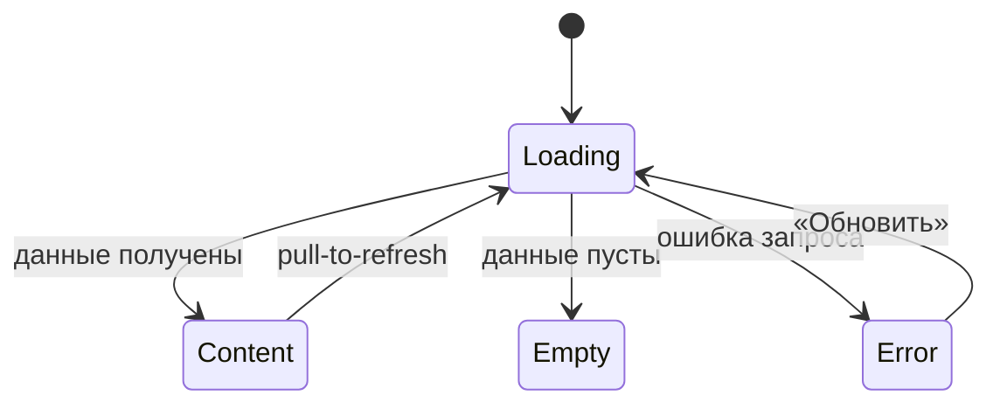

# Требования на дизайн · Foundations (сквозные правила)

> **Этап 3.** Сквозной документ дизайн-требований приложения «Апекс». Описывает принципы,
> структурные токены, паттерны навигации и состояний, доступность и микрокопию, **общие для
> всех экранов**. Экранные документы ссылаются сюда и не дублируют эти правила.

**Статус:** Черновик · **Версия:** 0.1 · **Дата:** 2026-06-15 · **Зона:** НЗ + АЗ

**Источники:**
[Фича-лист](../5-mobile-app-spec/feature-list.md) ·
[НФТ](../2-requirements/non-functional-requirements.md) ·
[ФТ](../2-requirements/functional-requirements.md) ·
[Use cases](../2-requirements/use-cases.md) ·
[User stories](../2-requirements/user-stories.md) ·
[Модель данных](../4-design/data-model.md)

> **Объём визуальных требований.** Документ задаёт **функционально-структурные** требования:
> иерархию, компоненты, поведение, ограничения. Конкретная палитра, шрифты и иллюстративный
> стиль — зона ответственности дизайнера; бренд в исходной аналитике не зафиксирован. Токены
> ниже описаны как **правила/уровни** (контраст, размеры, плотность), а не как hex/font-family.

---

## 1. Продукт и аудитория

**«Апекс»** — клиентское мобильное приложение для самостоятельной записи на заезды
в уличном картинг-центре. Заменяет ручную запись через Telegram и маркерную экипировку.

**Единственная роль — «Клиент».** Маршалы и владелец/администратор в приложение не входят (у них свои инструменты). Справочные данные (заезды, конфигурации трасс, маршалы) — read-only из API. Оплата — **офлайн** (наличные / перевод); приложение показывает цену и фиксирует запись, онлайн-оплаты нет.

**Контекст использования:** клиент может находиться прямо у уличной трассы, на ярком солнце, руки могут быть в перчатках или грязными, вокруг шум. Это диктует крупные элементы, высокий контраст и минимум шагов (NFR-1).

---

## 2. Дизайн-принципы

| # | Принцип | Источник | Что это значит для макета |
|---|---------|----------|---------------------------|
| P1 | **Mobile-first для улицы** | NFR-1 | Крупные тач-зоны, высокий контраст, читаемость на ярком солнце, минимум мелкого текста. |
| P2 | **Короткий путь к записи** | NFR-2 | От списка до подтверждения — **≤ 3 экранов**. Не добавлять необязательных шагов/полей. |
| P3 | **Минимальный порог входа** | NFR-3 | Регистрация — только имя + телефон, без пароля. Не запрашивать лишних данных. |
| P4 | **Воспринимаемая скорость** | NFR-6 | Скелетоны вместо пустого экрана; отклик списка и подтверждения ощущается < 2–3 с. |
| P5 | **Только свои данные** | NFR-11, NFR-12 | Клиент видит лишь свои брони и контакты; в UI нет доступа к чужим/админским данным. |
| P6 | **Честность и спокойствие** | UC-1/UC-2 | Ошибки и правила (отмена, ограничения по скорости/трассе) объясняются понятно и без давления; клиенту легко управлять своей бронью. |

---

## 3. Структурные токены (без бренда)

Дизайнер выбирает конкретные значения; ниже — обязательные **правила**.

### 3.1 Тач-зоны и размеры
- Минимальный размер интерактивного элемента — **≥ 44–48 pt** по меньшей стороне.
- Основной CTA — во всю ширину контентной области, высота не менее минимальной тач-зоны.
- Между кликабельными элементами — отступ, исключающий промахи «в спешке».

### 3.2 Контраст и читаемость (NFR-1)
- Контраст текста к фону — не ниже **WCAG AA** (обычный текст ≥ 4.5:1, крупный ≥ 3:1).
- Состояния не передаются **только цветом** — дублируются иконкой/текстом/формой
  (важно для солнца и дальтонизма).
- Важные числа (свободно картов, цена, время старта) — крупные и контрастные.

### 3.3 Типографическая иерархия (уровни, не шрифты)
- **Заголовок экрана** → **Заголовок секции/карточки** → **Основной текст** →
  **Вторичный/подпись (caption)**. Достаточно 4–5 уровней; держать единообразно.
- Минимальный размер основного текста комфортен для чтения на улице (не «мелкий серый»).

### 3.4 Плотность и сетка
- Единая шкала отступов (например, кратная базовому шагу) — задаёт дизайнер, применяет везде.
- Контент — в одну колонку (mobile-first), карточки разделены явными отступами/границами.

### 3.5 Иконки и индикаторы
- Иконки сопровождаются текстом в ключевых местах (таб-бар, статусы), не несут смысл в одиночку.
- Индикатор активных фильтров, бейдж статуса записи — визуально считываемы с первого взгляда.

---

## 4. Каркас экрана и навигация

### 4.1 Базовый каркас
```text
┌─────────────────────────────┐
│ Хедер (заголовок / назад)    │  ← фиксированный
├─────────────────────────────┤
│                              │
│ Скролл-контент               │  ← основная зона
│                              │
├─────────────────────────────┤
│ Фикс. нижний CTA (если есть) │  ← всегда виден, не перекрыт клавиатурой
└─────────────────────────────┘
│ Таб-бар (в АЗ, верхнеуровневые│  ← только на корневых экранах вкладок
│ экраны)                       │
└─────────────────────────────┘
```

### 4.2 Таб-бар (авторизованная зона)
Три верхнеуровневых раздела, всегда доступны на корневых экранах:
- **Заезды** ([SCR-002](SCR-002-slot-list.md)) — стартовая вкладка (список доступных слотов на ближайшие 7 дней).
- **Мои записи** ([SCR-005](SCR-005-my-bookings.md)).
- **Профиль** ([SCR-007](SCR-007-profile.md)).

Таб-бар скрывается на вложенных экранах (карточка заезда, оформление, детали брони) и на
bottom sheet. Каждая иконка сопровождается подписью.

### 4.3 Bottom Sheet (шторки BS-001 / BS-002 / BS-003)
Единые правила для всех шторок:
- Высота — по контенту, но не выше ~90% экрана; длинный контент скроллится внутри.
- **Бэкдроп** (затемнение фона) + закрытие по тапу вне шторки (кроме критичных подтверждений,
  где закрытие — только явной кнопкой).
- **Swipe-to-close** жестом вниз + видимый «грабер» (полоска) сверху.
- Явная кнопка закрытия/отмены. Действия-кнопки шторки — в её нижней части.
- Открытие/закрытие — плавная анимация снизу вверх.

### 4.4 Карта навигации
Полная карта переходов — в [фича-листе §3](../5-mobile-app-spec/feature-list.md). Каждый
экранный документ описывает свои входящие/исходящие переходы в разделе «Навигация».

### 4.5 Карта локации (статичный превью Яндекс.Карт)

Сквозной компонент для экранов, где показывается место проведения заезда ([SCR-003](SCR-003-slot-card.md),
[SCR-006](SCR-006-booking-details.md)). Описывается здесь один раз; экраны на него **ссылаются**.

```text
┌─────────────────────────────────┐
│  ░░░░░ карта (статичный превью) ░│
│  ░░░░░░░░░░░░░░░░░░░░░░░░░░░░░░░│
│  ░░░░░░░░░░░ 📍 ░░░░░░░░░░░░░░░░│  ← пин картинга (location_point)
│  [ Открыть карту › ]            │  ← тап → переход во внешнее приложение
├─────────────────────────────────┤
│  📍 Картинг-центр «Апекс»       │  ← текстовый блок под картой
│  ул. Моторная, 15, въезд с юга  │     (адрес/ориентир)
└─────────────────────────────────┘
```

- **Тип:** **статичное изображение** карты (Яндекс Static API) с **пином центра** (`location_point`). По умолчанию — статика, а не тяжёлый интерактив (улица, слабый интернет, батарея, P1/P4).
- **Тап по карте** → открывает системный диалог или сразу перенаправляет в Яндекс.Карты / 2ГИС для построения маршрута (handoff во внешнее приложение).
- **Текстовый блок адреса** под картой обязателен — он же служит текстовым эквивалентом (адрес/ориентир), считывается без карты (см. §7).
- **Состояния:**
  - *Loading* — скелетон в форме карты (не пустой блок).
  - *Error / offline / нет ключа карты* — **fallback на текст**: блок адреса + ссылка
    «Открыть в навигаторе»; экран не ломается, запись/просмотр остаются доступны.
- **Ключ API Яндекс.Карт** (Static API) — параметр конфигурации, в макет не зашивается.

---

## 5. Сквозной паттерн состояний экрана

Применяется ко **всем экранам с запросами к API**. Экранные документы лишь уточняют
специфику (тексты пустых состояний, конкретные ошибки), не переописывая паттерн.



| Состояние | Что показываем | Правило |
|-----------|----------------|---------|
| **Loading** | Скелетон/шиммер в форме будущего контента | Не пустой белый экран; не блокирующий спиннер по возможности (P4). |
| **Content** | Данные | Основной сценарий. |
| **Empty** | Заглушка + понятная подсказка + действие (если применимо) | Объясняет, почему пусто, и что сделать. (Например, нет заездов на эту неделю). |
| **Error** | Заглушка ошибки + кнопка **«Обновить»** | Нейтральный тон; не винит пользователя; даёт повтор. |

Специфичные состояния (например, **disabled CTA «Записаться»** при отсутствии свободных картов, бейдж **«Отменён центром»** из-за погоды) описаны в соответствующих экранных документах.

---

## 6. Tone of voice и общая микрокопия

**Тон:** простой, драйвовый, прямой, дружелюбный, без канцелярита. Обращение на «вы».
Сообщения — короткие, по делу, без вины и давления.

**Сквозные тексты (единые формулировки, переиспользуются экранами):**

| Контекст | Текст |
|----------|-------|
| Оплата | «Оплата на месте перед стартом: наличные или перевод.» |
| Лейблы экипировки | «Свой шлем» / «Прокатная экипировка» |
| Правило отмены | «Отменяйте заезд не позднее чем за 1 час до старта — место освободится для других. Если планы изменились прямо перед гонкой — всё равно отмените, штрафов нет.» |
| Поздняя отмена (итог) | «Поздняя отмена: место не освобождено (правило 1 часа). Штраф не взимается.» |
| Отмена по погоде | «Заезд отменён из-за погодных условий. Безопасность на трассе превыше всего.» |
| Кнопка повтора | «Обновить» |
| Сетевая ошибка (общая) | «Не удалось загрузить. Проверьте интернет и попробуйте снова.» |
| Сетевая ошибка при действии | «Не удалось выполнить. Проверьте соединение и повторите.» |
| Ошибка сервера (5xx) | «Что-то пошло не так. Механики уже чинят сервер, попробуйте позже.» |
| Ошибка действия (дефолт 4xx) | «Не удалось выполнить. Попробуйте ещё раз.» |

> Числовые лимиты (максимум картов на трассе) **не зашиваются в тексты** —
> подставляются из данных заезда/конфигурации.
>
> **Раздельная модель доступности.** Места в заезде и прокатная экипировка считаются **независимо**:
> - **Свободные карты** (за раз можно выбрать): `max_seats = min(free_seats, route.capacity_cap, 5)`. У новичковых трасс лимит может быть строже.
> - **Прокатная экипировка**: ограничение отдельное — проверяется по резерву шлемов на базе; своя экипировка не расходует прокатный фонд.

### 6.1 Каталог снеков успеха (единые формулировки)

Снек успеха показывается после **завершённого действия**, у которого результат не очевиден из
самого перехода. Тон — короткий, утвердительный. Единые тексты:

| Действие | Экран/Шторка | Текст снека успеха | Примечание |
|----------|--------------|--------------------|------------|
| Сохранение профиля (`updateProfile`) | [SCR-007](../5-mobile-app-spec/SCR-007-profile.md) | «Профиль обновлён» | — |
| Подтверждение телефона (`confirmPhoneChange`) | [SCR-007](../5-mobile-app-spec/SCR-007-profile.md) | «Изменения сохранены» | После успешного ввода кода. |
| Оценка маршала (`rateMarshal`) | [BS-004](../5-mobile-app-spec/BS-004-rate-marshal.md) | «Спасибо за оценку!» | Показывается на экране истории заездов. |
| Выход из аккаунта (`logout`) | [SCR-007](../5-mobile-app-spec/SCR-007-profile.md) | — (снек не показывается) | Обратная связь — переход на [SCR-001](../5-mobile-app-spec/SCR-001-registration.md). |
| Отмена брони (`cancelBooking`, ранняя) | [BS-003](../5-mobile-app-spec/BS-003-cancel-confirm.md) → [SCR-006](../5-mobile-app-spec/SCR-006-booking-details.md) | «Бронь отменена» | Показывает экран-родитель после закрытия шторки. |
| Отмена брони (`cancelBooking`, поздняя) | [BS-003](../5-mobile-app-spec/BS-003-cancel-confirm.md) → [SCR-006](../5-mobile-app-spec/SCR-006-booking-details.md) | «Поздняя отмена: место не освобождено. Штраф не взимается.» | Это **успешный** исход (см. таблицу выше), а не ошибка. |
| Создание брони (`createBooking`) | [SCR-004](../5-mobile-app-spec/SCR-004-booking.md) → [BS-002](../5-mobile-app-spec/BS-002-booking-success.md) | — (снек не показывается) | Переход на шторку успеха [BS-002](../5-mobile-app-spec/BS-002-booking-success.md) с детальной сводкой. |
| Применение фильтров | [BS-001](../5-mobile-app-spec/BS-001-filters.md) → [SCR-002](../5-mobile-app-spec/SCR-002-slot-list.md) | — (снек не показывается) | Обратная связь — обновлённый список. |
| Успешный pull-to-refresh | любой список | — (снек не показывается) | Обратная связь — обновлённый контент. |

### 6.2 Кто показывает снек при закрытии шторки

Когда действие выполняется на **шторке** (bottom sheet), а её результат нужно показать после
закрытия — единое правило:

- Снек **успеха/итога** действия, после которого шторка закрывается, показывает **экран-родитель**
  (он остаётся на экране и переживает закрытие шторки). 
- Снек **ошибки** действия, при которой шторка **остаётся открытой** (можно повторить), показывает
  **сама шторка**.
- **Нельзя дублировать** обратную связь (если есть шторка успеха, снек об успехе не показывается).

### 6.3 Снеки vs Error-заглушка (разграничение)

- **Снеком** сообщаются результаты **действий** (отправка формы, тап CTA) и **ошибка при pull-to-refresh** (контент на экране сохраняется). Источник текста: 4xx с `message` → текст из `message`; 4xx без `message` → дефолт (§6); 5xx → «Что-то пошло не так…»; сеть → сетевой текст (§6).
- **Error-заглушкой** (состояние Error + «Обновить», §5) сообщается провал **первичной загрузки** данных экрана, когда показывать нечего.

> **Единый источник правила отмены.** Полный текст правила «1 часа» и формулировки отмены задаются **только здесь**. Экраны [SCR-006](SCR-006-booking-details.md) и [BS-003](BS-003-cancel-confirm.md) **ссылаются** на эти формулировки. Граничный случай **«ровно 1 час до старта» трактуется как ранняя отмена**.

---

## 7. Доступность (NFR-1, R-029 — WCAG AA)

Целевой уровень — **WCAG 2.1 AA**. Обязательные требования:

- **Контраст:** не ниже WCAG AA (обычный текст ≥ 4.5:1, крупный ≥ 3:1) — см. §3.2.
- **Тач-зоны:** интерактивные элементы — **≥ 44 pt** по меньшей стороне, с отступами (§3.1).
- **Dynamic type:** поддержка системного увеличения шрифта; макет не ломается (перенос вместо обрезки).
- **Screen reader:** все интерактивные элементы имеют доступное имя; статусы (мало картов, отменено) озвучиваются.
- **Не только цвет:** состояния (свободно/нет картов, статус брони) дублируются иконкой/текстом/формой.
- **Малые экраны:** макет корректно работает на компактных устройствах.
- Фокус-состояния и обратная связь на тап обязательны.
- **Карта (§4.5) — не единственный носитель:** адрес центра обязательно продублирован **текстом**.

---

## 8. Сквозные функции

### 8.1 Напоминания и уведомления
- Заблаговременное напоминание о заезде; критичное уведомление об отмене заезда по погодным условиям (R-008).
- **Канал — push.** Доставку обеспечивает существующая инфраструктура (бэкенд); приложение регистрирует push-токен.
- **Запрос разрешения на push показывается после первой успешной записи** — на шторке
  подтверждения [BS-002](BS-002-booking-success.md), а не на старте. Экран входа разрешение **не запрашивает**.

### 8.2 Безопасность данных в UI (NFR-11, NFR-12)
- На экранах отображаются только данные текущего клиента.
- Клиент не видит список других участников заезда (конфиденциальность).

### 8.3 Поведение офлайн и сетевые ошибки
- **Просмотр кэша офлайн разрешён:** ранее загруженные списки/детали показываются из кэша с видимой пометкой («Данные могут быть неактуальны»).
- **Мутации офлайн запрещены:** запись, отмена, оценка маршала при отсутствии сети блокируются с сообщением «нет интернета».
- **Единый паттерн Error / Retry:** все сетевые сбои ведут к состоянию Error с кнопкой «Обновить» или к снеку ошибки с возможностью повтора.
- **Таймаут запроса — ~10 с:** по истечении показывается ошибка, экран не «висит».

---

## 9. Глоссарий

| Термин | Значение |
|--------|----------|
| **Заезд / Слот** | Конкретная гонка: дата, время старта, конфигурация трассы, маршал, цена, всего/свободно картов. |
| **Конфигурация** | Вариант трассы (короткая для новичков / длинная для опытных); свой потолок мест и ограничение скорости. |
| **Экипировка** | Защитный инвентарь (шлем, подшлемник): прокатная или собственная. |
| **Маршал** | Инструктор-судья, проводящий брифинг и следящий за безопасностью на трассе. |
| **Бронь** | Запись клиента на заезд: число картов, тип экипировки, статус. |
| **Ранняя отмена** | Отмена ≥ 1 ч до старта → карт возвращается в свободный пул заезда. |
| **Поздняя отмена** | Отмена < 1 ч до старта → карт не освобождается (простой), штрафов нет. |

---

## 10. Карта документов дизайн-требований

| ID | Документ |
|----|----------|
| — | **00-foundations.md** (этот файл) |
| SCR-001 | [Регистрация / Вход](SCR-001-registration.md) |
| SCR-002 | [Список заездов](SCR-002-slot-list.md) |
| BS-001 | [Фильтры](BS-001-filters.md) |
| SCR-003 | [Карточка заезда](SCR-003-slot-card.md) |
| SCR-004 | [Оформление брони](SCR-004-booking.md) |
| BS-002 | [Подтверждение записи](BS-002-booking-success.md) |
| SCR-005 | [Мои заезды](SCR-005-my-bookings.md) |
| SCR-006 | [Детали брони + отмена](SCR-006-booking-details.md) |
| BS-003 | [Подтверждение отмены](BS-003-cancel-confirm.md) |
| BS-004 | [Оценка маршала](BS-004-rate-marshal.md) |
| SCR-007 | [Профиль клиента](SCR-007-profile.md) |