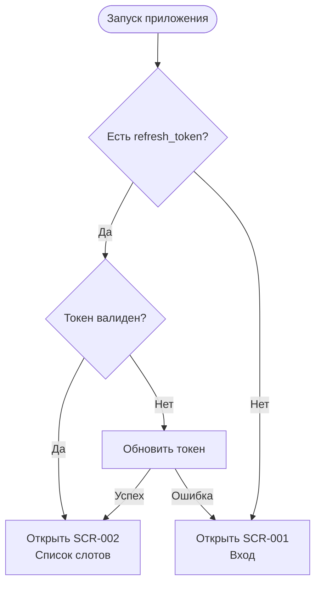

# OTP-авторизация и сессия

**ID:** LOGIC-001  
**Тип:** Логика  
**Домен:** 09. Логики  
**Приоритет:** Critical  
**Статус:** Черновик  
**Функциональные блоки:** FB-AUTH-001 (Вход по телефону), FB-AUTH-002 (Сессия и выход)

---

## История изменений

| Релиз | ТЗ | Описание изменений |
|-------|-----|-------------------|
| — | — | Первоначальная документация |

---

## Входные данные

| Название | Тип | Возможные значения | Описание |
|----------|-----|-------------------|----------|
| `access_token` | Защищённое хранилище (Keychain / Keystore) | JWT-строка / отсутствует | **Короткоживущий** Bearer-токен доступа. Подставляется в `Authorization: Bearer <access_token>` во все авторизованные запросы. |
| `refresh_token` | Защищённое хранилище (Keychain / Keystore) | строка / отсутствует | **Долгоживущий** refresh-токен. Используется для тихого обновления `access_token`. |
| `expires_in` | Состояние | integer (секунды) | Срок жизни `access_token` в секундах. |
| `phone` | Состояние | E.164 формат | Введённый номер телефона. |
| `resend_after_seconds` | Состояние | integer | Таймер повторной отправки кода. |
| `is_new` | Состояние | `true` / `false` | Новый пользователь или уже зарегистрирован. |

---

## Обзор

Логика описывает бесшовный вход в нативное мобильное приложение **«Карт»** по номеру телефона без пароля через одноразовый код (OTP). Применяется на экране регистрации/входа ([SCR-001](../SCR-001-registration.md)) и реализует трёхшаговый поток: ввод телефона → ввод кода из SMS → ввод имени (только для новых пользователей). После подтверждения сервер выдаёт пару JWT-токенов, которые сохраняются в защищённом хранилище ОС.

### Модель сессии

- **`access_token`** — короткоживущий токен для авторизованных запросов.
- **`refresh_token`** — долгоживущий токен для обновления сессии.
- Автоматическое обновление токена при истечении.
- При выходе или удалении аккаунта — инвалидация токенов.

### User Story

> Как пилот карт-клуба, я хочу входить в приложение по номеру телефона без пароля,
> чтобы быстро записаться на заезд, не запоминая логин и пароль.

### Бизнес-ценность

- Низкий порог входа для новых клиентов.
- Быстрый доступ к бронированию слотов.
- Безопасное хранение сессии в защищённом хранилище устройства.

---

## Точки применения

| Экран/Компонент | Элемент/Триггер | Условие |
|-----------------|-----------------|---------|
| [SCR-001 Регистрация / Вход](../SCR-001-registration.md) | Кнопка «Получить код» | Введён валидный телефон |
| [SCR-001 Регистрация / Вход](../SCR-001-registration.md) | Кнопка «Подтвердить код» | Введён код из SMS |
| [SCR-007 Профиль](../SCR-007-profile.md) | Выход из аккаунта | Активная сессия |
| [SCR-007 Профиль](../SCR-007-profile.md) | Удаление аккаунта | Активная сессия |

---

## Флоу

**Примечание:** Полная детализация флоу — в документе SCR-001.