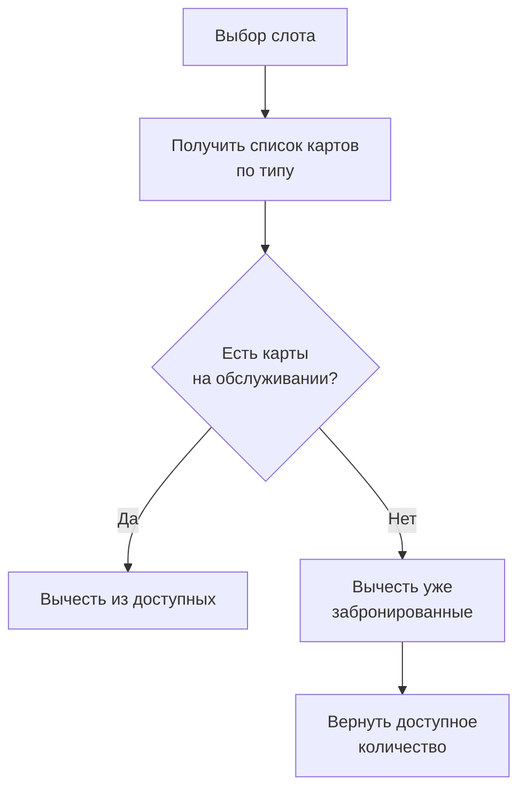

# Расчёт доступности картов и слотов

**ID:** LOGIC-002  
**Тип:** Логика  
**Домен:** 09. Логики  
**Приоритет:** Critical  
**Статус:** Черновик  
**Функциональные блоки:** FB-AVAIL-001 (Доступность картов), FB-AVAIL-002 (Доступность слотов)

---

## История изменений

| Релиз | ТЗ | Описание изменений |
|-------|-----|-------------------|
| — | — | Первоначальная документация |

---

## Входные данные

| Название | Тип | Возможные значения | Описание |
|----------|-----|-------------------|----------|
| `slot_id` | Состояние | UUID | Идентификатор выбранного слота |
| `kart_type` | Состояние | `standard`, `racing`, `junior` | Тип карта |
| `requested_seats` | Состояние | integer (1–10) | Запрашиваемое количество мест |
| `current_time` | Состояние | timestamp | Текущее время для проверки просроченных броней |

---

## Обзор

Логика отвечает за расчёт реальной доступности картов и слотов на треке. Учитывает общее количество картов каждого типа, уже забронированные места, техническое обслуживание и правила одновременного нахождения на трассе.

### Основные правила

- На одном слоте одновременно может находиться ограниченное количество картов (обычно 8–12 в зависимости от конфигурации трассы).
- Каждый карт имеет свой статус: доступен / на обслуживании / забронирован.
- При бронировании проверяется наличие свободных картов нужного типа.

### User Story

> Как клиент, я хочу видеть только те слоты и типы картов, которые реально доступны в выбранное время,
> чтобы не тратить время на оформление невозможной брони.

### Бизнес-ценность

- Снижение количества отмен и негативных отзывов.
- Честная и прозрачная информация для клиентов.
- Оптимизация загрузки парка картов.

---

## Точки применения

| Экран/Компонент | Элемент | Условие |
|-----------------|---------|---------|
| [SCR-003 Карточка слота](../SCR-003-slot-card.md) | Блок «Доступно картов» | При открытии карточки слота |
| [SCR-004 Оформление брони](../SCR-004-booking.md) | Выбор типа карта и количества | При изменении выбора |
| [SCR-002 Список слотов](../SCR-002-slot-list.md) | Карточки слотов | При загрузке списка |

---

## Флоу (упрощённо)

