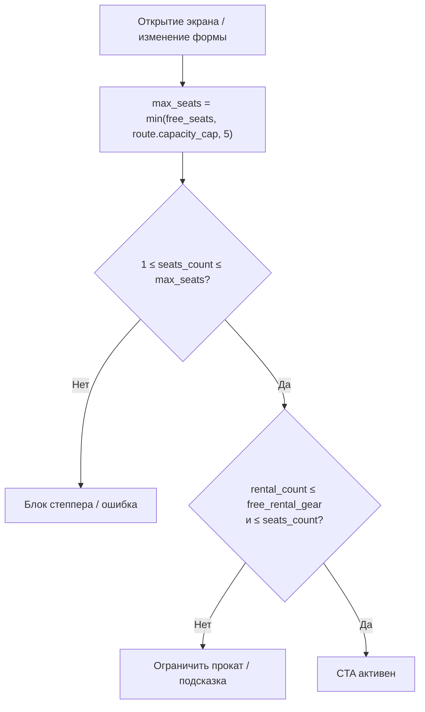

# Расчёт доступности мест и прокатной экипировки

**ID:** LOGIC-002  
**Тип:** Логика  
**Домен:** 09. Логики  
**Приоритет:** Critical  
**Статус:** Актуален  
**Источник:** [brief-karting.md](../../0-customer-brief/brief-karting.md), [customer-questions.md](../../1-elicitation/customer-questions.md) §1–3, R-013, R-015

---

## Входные данные

| Название | Тип | Описание |
|----------|-----|----------|
| `slot.free_seats` | integer | Свободно мест (картов) в заезде |
| `slot.free_rental_gear` | integer | Свободно прокатных комплектов экипировки (шлем + подшлемник) |
| `slot.route.capacity_cap` | integer | Потолок трассы: новичковая ≤ 8, опытная ≤ 14 |
| `slot.route.type` | enum | `novice` / `experienced` |
| `seats_count` | integer (ввод) | Запрашиваемое число мест (1..5) |
| `rental_count` | integer (ввод) | Число мест с прокатной экипировкой (0..seats_count) |

---

## Правила (R-013, R-015)

**Два независимых лимита:**

1. **Места (карты):**
   `max_seats = min(free_seats, route.capacity_cap, 5)`
   - `seats_count` ∈ [1, max_seats]
   - «Своя экипировка» занимает место, но **не** уменьшает `free_rental_gear`

2. **Прокатная экипировка:**
   `rental_count ≤ free_rental_gear` и `rental_count ≤ seats_count`

**CTA «Записаться» активна**, если:
- `slot.status = scheduled`
- `free_seats > 0`
- выбранные `seats_count` и `rental_count` укладываются в лимиты

---

## User Story

> Как клиент, я хочу видеть реальное число свободных картов и доступность проката экипировки,
> чтобы не оформлять невозможную бронь.

---

## Точки применения

| Экран | Элемент |
|-------|---------|
| [SCR-002 Список заездов](../SCR-002-slot-list.md) | Бейдж «Свободно N из M», кликабельность карточки |
| [SCR-003 Карточка заезда](../SCR-003-slot-card.md) | Блоки «Места» / «Прокатная экипировка», CTA |
| [SCR-004 Оформление записи](../SCR-004-booking.md) | Степпер мест, переключатели экипировки, валидация CTA |

---

## Флоу

